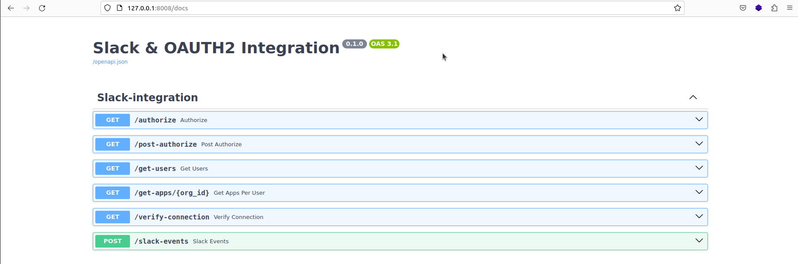
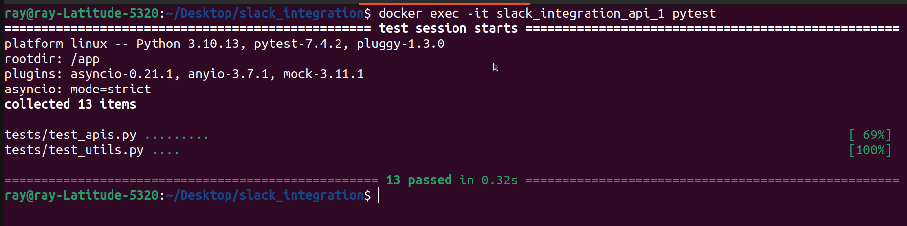

# Slack and OAUTH2 Integration with FastAPI

Connect to Slack app using OAUTH2 and FastAPI

# Setup

Create a .env file by copying the .env.sample provided

## Running locally

Run:

```
docker-compose -f docker-compose.dev.yml up --build
```

to build and run the container using the dev yaml file.

Access docs:
```sh
http://127.0.0.1:8008/docs
```

# APIs Doc


## Run tests

Run descriptive tests in the container using:

```
docker compose exec <docker_container_name> pytest -rP -vv
```

# Tests Output


## Resources

https://api.slack.com/authentication/oauth-v2

https://api.slack.com/methods

https://api.slack.com/methods/users.list

https://api.slack.com/methods/users.info

https://api.slack.com/methods/auth.test

https://api.slack.com/scopes/admin.apps:read


FILE EVENTS:

https://api.slack.com/events-api

https://api.slack.com/events/file_shared

https://api.slack.com/methods/files.info

https://api.slack.com/types/file#auth

https://api.slack.com/apis/connections/events-api#responding